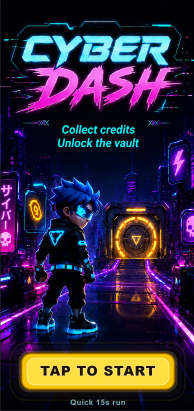
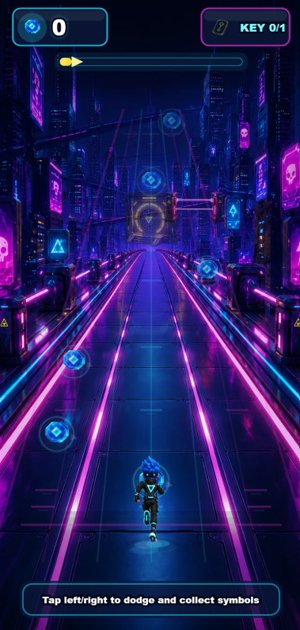
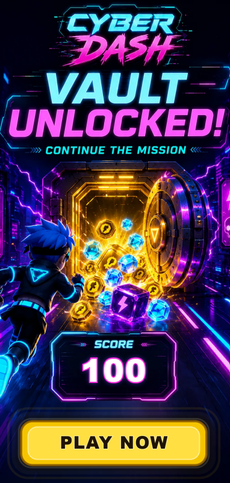
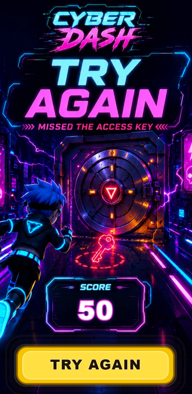

# Cyber Dash

Mobile-first HTML5 playable ad built with PixiJS, TypeScript and Vite.

Cyber Dash is a compact 3-lane runner designed around a simple mobile ad interaction: dodge obstacles, collect symbols, grab the access key and unlock the vault before the final end card.

## Live Demo

https://cristianmarcu.ro/cyber-dash/

## Screenshots

| Intro                                           | Gameplay                                              |
| ----------------------------------------------- | ----------------------------------------------------- |
|  |  |

| Success End Card                                                      | Try Again End Card                                                        |
| --------------------------------------------------------------------- | ------------------------------------------------------------------------- |
|  |  |

## Why This Project

Cyber Dash was built as a small playable ad prototype focused on the kind of constraints that matter for mobile gaming advertising:

- Fast first load
- Low request count
- Small production build
- Mobile-first portrait layout
- Clear one-touch interaction
- Local static assets
- HTML5-friendly deployment
- CTA-ready end card
- Simple gameplay loop that can be understood in seconds

The goal was not to build a full game, but a polished playable ad experience with a clear start, interaction, reward moment and call to action.

## Gameplay

The player starts in the center lane and can move one lane left or right. During the run, the player avoids laser gates and cyber crates, collects symbols for score and tries to grab the access key before reaching the vault.

If the key is collected, the run ends with a success end card, final score and a `PLAY NOW` call to action. If the key is missed, the run ends with a retry screen.

## Controls

- Tap or click the left side of the screen to move one lane left
- Tap or click the right side of the screen to move one lane right
- Swipe left or right on mobile to switch lanes
- Use `ArrowLeft` and `ArrowRight` on desktop for testing

## Tech Stack

- PixiJS for rendering, sprites, layers, animation, VFX, input and the ticker loop
- TypeScript for typed gameplay logic and maintainable source code
- Vite for local development and production builds
- React for mounting and unmounting the PixiJS canvas
- Local WebP assets for lightweight delivery
- Fixed mobile portrait design space scaled to the host viewport

## Source Organization

The source is organized around the main responsibilities of a playable ad runtime:

- `CyberDashGame.ts` coordinates app lifecycle, game states and the main update loop
- `track.ts` and `trackRuntime.ts` handle lane perspective, object depth and track placement
- `level.ts` defines the run sequence for symbols, obstacles and the access key
- `collisions.ts` resolves symbol, key and obstacle collision events
- `input.ts` handles pointer, swipe and keyboard controls
- `gameEffects.ts` manages dust, score feedback and lightweight visual effects
- `finishRun.ts` handles the final movement into the vault
- `vault.ts` manages the vault visual state
- `tutorial.ts` controls the in-game helper message
- `screens.ts` manages layer visibility between intro, gameplay, finish and end states
- `viewport.ts` handles responsive scaling for the PixiJS scene
- `cta.ts` dispatches the playable ad CTA event

## Ad-Focused Implementation Notes

- React is only used as the page shell and canvas mount point
- Gameplay UI is rendered in PixiJS, not with DOM overlays
- All runtime assets are local and loaded from `public/assets`
- The build is designed to work from a subfolder deployment using `base: "./"`
- The player, symbols, key, obstacles and markers share the same lane perspective system
- The end card dispatches a custom CTA event instead of hardcoding a platform-specific integration
- Visual effects use lightweight PixiJS `Graphics` objects instead of extra image sequences or audio files
- Cleanup removes ticker callbacks, input listeners, resize observers, containers and the canvas view

## How To Run

```bash
npm install
npm run dev
```

Open the local Vite URL shown in the terminal.

## How To Build

```bash
npm run build
npm run preview
```

The production build is emitted to `dist/`.

## Production Checks

Latest local production checks:

- Build command: `npm run build`
- `dist/` size: approximately `2.0 MB`
- `dist/` file count: `27`
- Browser first-load request count: approximately `31`
- Verified under the 5 MB playable ad target
- Verified under the 100 request target
- Tested in Chrome Incognito with cache disabled
- No external CDN assets
- No remote runtime assets
- Hosted successfully from `/cyber-dash/`

## Ad Preview Test

The hosted build can be tested inside an iframe-based ad preview environment using the live URL:

```html
<iframe
  src="https://cristianmarcu.ro/cyber-dash/"
  width="390"
  height="844"
  frameborder="0"
  scrolling="no"
  style="border:0; overflow:hidden;"
></iframe>
```

Suggested preview size:

- Width: `390`
- Height: `844`
- Orientation: mobile portrait

When testing the iframe preview, the expected flow is:

1. The intro screen loads
2. `Tap to Start` begins the run
3. Tap/click left and right moves the player between lanes
4. Symbols, obstacles and the access key appear during gameplay
5. Collecting the access key unlocks the success path
6. Missing the access key shows the retry screen
7. `Try Again` restarts the run without reloading the page
8. The success end card shows the final score and `PLAY NOW` CTA
9. The CTA can be triggered from the end card

A page-level scrollbar may appear in some external preview tools if the preview interface plus the `390 x 844` iframe is taller than the browser viewport. The creative itself is rendered in a fixed-size iframe with scrolling disabled.

## Test Checklist

- Intro screen loads correctly
- Tap to start begins the run
- Tap, swipe and arrow-key lane movement work
- Symbols increase score
- Obstacles trigger score penalty and feedback
- Access key updates the HUD and unlocks the success path
- Missing the key shows the retry screen
- Try Again restarts the run cleanly
- Success end card shows final score and CTA
- CTA event is dispatched from the end card
- Hosted version loads without missing assets
- Mobile portrait viewport remains readable
- No console errors from the hosted creative
- No missing local runtime assets
- No new asset downloads are required after pressing Try Again

## AI Usage

AI tools were used as a support tool for visual exploration, quick technical checks and documentation drafting. The gameplay direction, implementation decisions, testing, deployment and final review were handled manually.

More details are available in [`AI_USAGE.md`](AI_USAGE.md).
